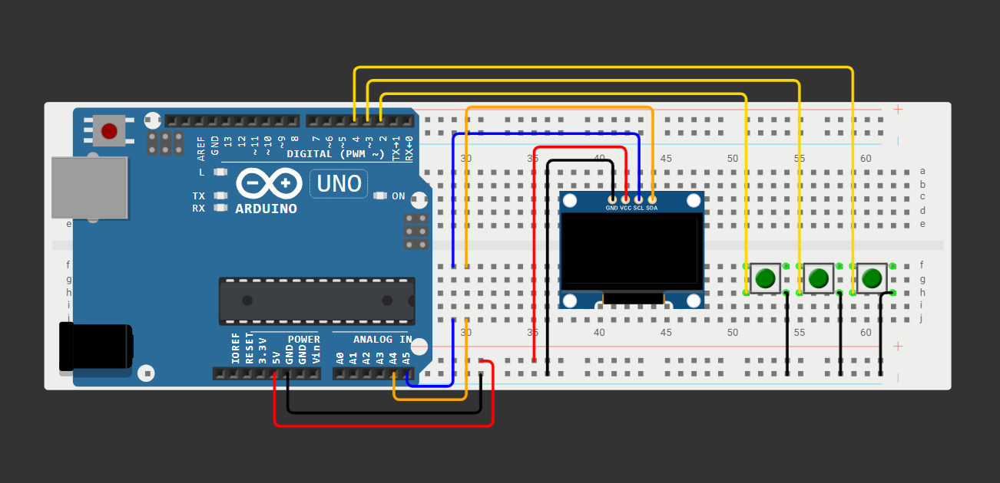

# PONG OLED – Arduino-Projekt



Ein kleines, vollständiges Pong-Spiel für ein 0,96" SSD1306-OLED am Arduino UNO.  
Das Projekt eignet sich ideal als Übungsprojekt für

- Arbeiten mit I²C-Displays  
- Abfragen von Tastern mit `INPUT_PULLUP`  
- einfachem Game-Loop (Timing, Zustände, KI)  

Auf dem OLED läuft ein klassisches Pong-Spiel mit

- 3×3-Pixel-Ball  
- Spieler-Paddle rechts  
- CPU-Paddle links  
- Start-/Pause-Taste  
- Hard-Reset-Kombination  
- Demo-/Attract-Mode (CPU vs. CPU, wenn niemand spielt)

Version im Sketch: `PONG OLED v1.0.0`

---

## Features auf einen Blick

- 128×64-OLED (SSD1306, I²C)  
- Ball als 3×3-Quadrat mit „Spin“ (vertikale Geschwindigkeitsänderung)  
- Mittellinie und Rahmen über den ganzen Screen  
- Punktestand (bis 5 Punkte)  
- Start-Screen, Spiel-Screen, Pause-Screen, Game-Over-Screen  
- Demo-/Attract-Mode (CPU vs. CPU) nach 15 s Inaktivität im Start-Screen  
- Hard-Reset: gleichzeitiger Druck von DOWN (D3) und START (D4)  
- Entprellte Bedienung des Start-/Pause-Buttons (Aktion beim Loslassen → kein Flackern)

Version im Sketch: `PONG OLED v1.0.0`

---

## Benötigte Hardware

- 1× Arduino UNO R3 (ATmega328P, USB-C, CH340G oder kompatibel)  
- 1× 0,96" SSD1306 OLED Display, 128×64, I²C (4-Pin: GND, VCC, SCL, SDA)  
- 3× Taster (Momentary Push Buttons)  
- 3× Dupont-Kabel zu den Tastern vom Arduino (Signalleitungen)  
- ein paar Jumperkabel (m/w oder m/m)  
- 1× Breadboard  
- USB-Kabel zum Programmieren und Versorgen

Widerstände sind für die Taster nicht notwendig, da `INPUT_PULLUP` verwendet wird  
(der interne Pull-Up-Widerstand im ATmega übernimmt das).

---

## Verkabelung

### OLED (SSD1306 I²C)

| OLED-Pin | Arduino UNO | Beschreibung      |
|---------:|-------------|-------------------|
| GND      | GND         | Masse             |
| VCC      | 5V          | Versorgung 5 V    |
| SCL      | A5          | I²C-Takt          |
| SDA      | A4          | I²C-Daten         |

OLED-Adresse im Sketch: `0x3C`

```cpp
Adafruit_SSD1306 display(SCREEN_WIDTH, SCREEN_HEIGHT, &Wire, OLED_RESET);
// ...
display.begin(SSD1306_SWITCHCAPVCC, 0x3C);
```

### Taster

Alle Taster werden gegen GND geschaltet.  
Die Eingänge sind als `INPUT_PULLUP` definiert → ungedrückt = HIGH, gedrückt = LOW.

| Funktion       | Arduino-Pin | Anschluss am Breadboard                           |
|----------------|------------:|---------------------------------------------------|
| UP             | D2          | Taster zwischen D2 und GND                        |
| DOWN           | D3          | Taster zwischen D3 und GND                        |
| START/PAUSE    | D4          | Taster zwischen D4 und GND                        |

Zusammenfassung:

- Eine Seite jedes Tasters auf einen Digital-Pin (2, 3, 4)  
- Die andere Seite jedes Tasters gemeinsam auf GND  

---

## Software-Voraussetzungen

- Arduino IDE (1.8.x oder 2.x)  
- Board: **Arduino Uno** (ATmega328P)  
- Bibliotheken (über den Library Manager installierbar):

  - `Adafruit GFX Library`
  - `Adafruit SSD1306`

In der `Adafruit_SSD1306.h` darf `SSD1306_128_64` aktiv sein (Standard).  
Im Sketch ist `#define SSD1306_NO_SPLASH` gesetzt, um das Adafruit-Logo zu unterdrücken.

---

## Installation

1. Arduino IDE starten  
2. Über den Library Manager die Bibliotheken installieren:
   - `Sketch → Include Library → Manage Libraries…`
3. Neues Projekt anlegen, z. B. `PongOLED.ino`  
4. Den vollständigen Sketch aus diesem Projekt in die `.ino`-Datei kopieren  
5. Board und Port einstellen:
   - `Tools → Board → Arduino AVR Boards → Arduino Uno`
   - `Tools → Port → (den UNO auswählen)`
6. Mit dem USB-Kabel den UNO verbinden  
7. `Sketch → Upload` ausführen  
8. Nach erfolgreichem Upload startet das Spiel im **Start-Screen**

---

## Bedienung

### Tastenbelegung

- `UP` (Pin D2): Spieler-Paddle nach oben bewegen  
- `DOWN` (Pin D3): Spieler-Paddle nach unten bewegen  
- `START` (Pin D4): Start, Pause, Fortsetzen, Menü

### Spielzustände

#### 1. Start-Screen

Auf dem OLED:

- Titel „PONG OLED“  
- Version  
- kurze Anleitung (UP/DOWN, START)

Aktionen:

- kurzer Druck auf `START` (Loslassen): neues Spiel starten  
- keine Bedienung → nach 15 Sekunden startet der **Demo-Mode**

#### 2. Playing (Spiel läuft)

- Rechtes Paddle: Spieler  
- Linkes Paddle: CPU  
- Ball bewegt sich mit 3×3-Größe und leichter „Spin-Logik“  
- Oben werden die Punkte angezeigt (links CPU, rechts Spieler)  

Aktionen:

- `UP`/`DOWN` drücken: Paddle bewegen  
- `START` kurz drücken: Spiel pausieren (Pause-Screen)  

Siegbedingung:

- Wer zuerst 5 Punkte erreicht, gewinnt  
- Danach erscheint der **Game-Over-Screen**

#### 3. Pause

Anzeige: „PAUSE“ und Hinweis „START = weiter“.

Aktionen:

- `START` erneut drücken: Spiel wird fortgesetzt  
  (Ball-Timing wird dabei sauber neu gesetzt, kein „Vorsprung“ des Balls)

#### 4. Game Over

Anzeige:

- „GAME OVER“  
- „Du gewinnst“ oder „CPU gewinnt“  
- Hinweis „START = Menu“

Aktionen:

- `START` drücken: zurück zum **Start-Screen**  
- Von dort kann ein neues Spiel gestartet werden

#### 5. Demo-Mode (Attract Mode)

Wird automatisch aktiviert, wenn im Start-Screen länger als 15 Sekunden
keine Taste gedrückt wurde.

- CPU spielt gegen CPU (beide Paddles automatisch)  
- Keine Punkteanzeige, stattdessen kleines „DEMO“ oben  
- Ball prallt an allen Wänden und beiden Paddles ab, ohne Torwertung

Aktionen:

- Beliebige Taste (`UP`, `DOWN` oder `START`) drücken:
  - Demo wird beendet
  - zurück zum **Start-Screen**

---

## Hard-Reset (Spiel zurücksetzen)

Ein globaler Reset (ohne Re-Upload) ist über eine Tastenkombination möglich:

1. `DOWN` (D3) und `START` (D4) gleichzeitig drücken  
2. Beide Tasten wieder loslassen

Ergebnis:

- Punktestand zurückgesetzt (`0 : 0`)  
- Paddles auf Ausgangsposition  
- Ball neu zentriert  
- Zurück in den **Start-Screen**  
- Demo-Mode ist deaktiviert

Diese Kombination funktioniert in jedem Spielzustand.

---

## Anpassungen im Code

Im Sketch können einige Parameter einfach geändert werden:

```cpp
#define GAME_TITLE    "PONG OLED"
#define GAME_VERSION  "v1.0.0"

const unsigned long PADDLE_RATE     = 33;    // Paddle-Geschwindigkeit (ms)
const unsigned long BALL_RATE       = 16;    // Ball-Geschwindigkeit (ms)
const unsigned long DEMO_TIMEOUT_MS = 15000; // Inaktivität bis Demo (ms)

const uint8_t PADDLE_HEIGHT = 16;
const uint8_t BALL_SIZE     = 3;
```

Mögliche Anpassungen:

- `PADDLE_RATE` verkleinern → Paddles bewegen sich schneller  
- `BALL_RATE` verkleinern → Ball wird schneller  
- `DEMO_TIMEOUT_MS` erhöhen/verringern → Demo-Mode früher/später starten  
- `PADDLE_HEIGHT` ändern → größere/kleinere Paddles  
- `BALL_SIZE` ändern → größerer/kleinerer Ball

Nach Änderungen einfach neu kompilieren und auf den UNO hochladen.

---

## Fehlerbehebung

**Display bleibt schwarz**

- Stimmt die I²C-Adresse? Typisch: `0x3C`  
- Sind `SDA` und `SCL` korrekt mit `A4` und `A5` verbunden?  
- Liegt VCC wirklich an 5 V und GND an GND?  
- Sind die Adafruit-Bibliotheken korrekt installiert?

**Taster reagieren „falsch herum“**

- Prüfen, ob der Taster wirklich zwischen Pin und GND hängt  
- `INPUT_PULLUP` bedeutet: ungedrückt = HIGH, gedrückt = LOW  
- Invertierte Logik in deinem Wiring? → GND/5V vertauscht

**Spiel flackert bei gedrücktem Start-Button**

- Dieses Projekt arbeitet mit „Click auf Loslassen“  
- Wenn du den Code geändert hast, sicherstellen, dass `startClick`
  weiterhin nur beim Wechsel von gedrückt → losgelassen ausgelöst wird.
